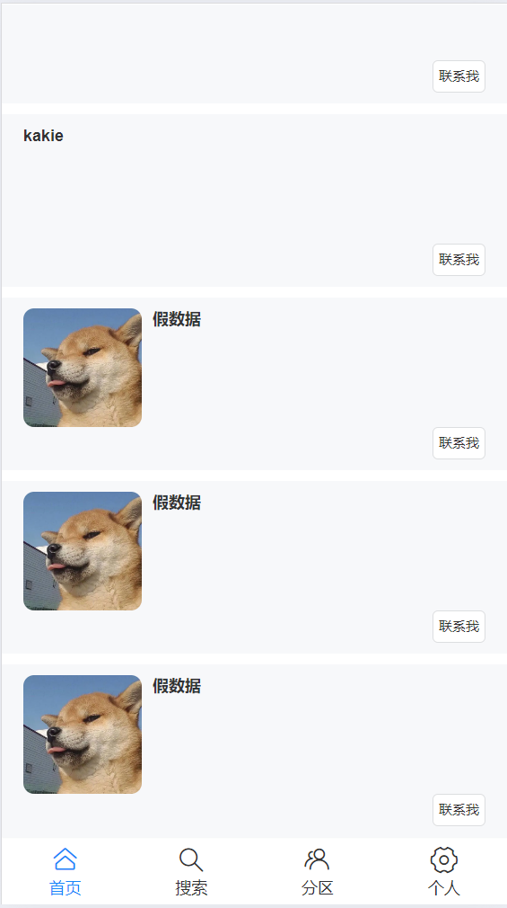
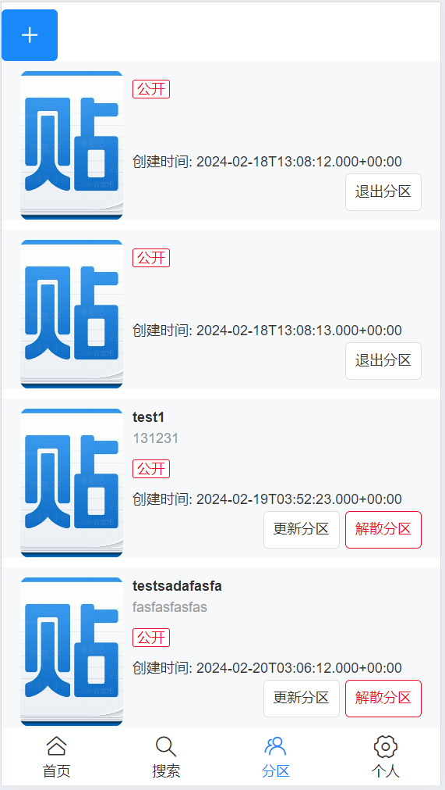
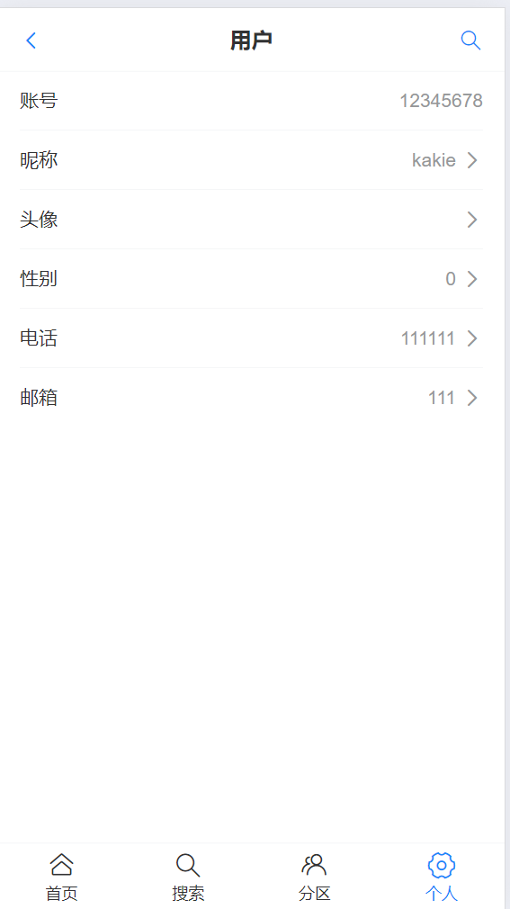

# 基本介绍
 基于Vue3 + Springboot3实现的前后端分离仿百度贴吧移动端论坛项目。

这个项目写的很简陋，~~主要是太懒了，前端基本没咋写，就把这个项目当作一个独立的后端项目吧~~。主要目的是熟悉SpringBoot3和vite以及vant ui库。此外也试着写了一下分布式锁。

# 效果图（Todo)

太丑了暂时只放一些

# 技术

## 前端

- Vue3

- Vant4 ui
- Vue-router
- axios
- vite

## 后端

- Springboot3
- Redis
- Gson
- MySQL
- Maven
- Swagger + knif4j
- MyBatis-Plus
- Redisson 分布式锁
- Spring Scheduler

# Todo

- [ ] 前端界面优化
- [ ] 实现相似度匹配算法

# 实现功能

## 整体

- 用户：登录 注册 退出
- 首页：贴吧列表
- 用户信息修改
- 贴吧的增删改查操作

## 后端

- Redis存储Session
- 全局异常处理
- 操作日志记录

# 运行

将项目clone到本地

## 前后端分离

由于项目还没有进行打包上线，目前仅支持前后端分离运行

### 前端

1. 进入到`bbs_frontend`文件夹

2. `npm install`安装相关依赖
3. `npm run dev`运行。默认端口为`localhost:5173`

### 后端

1. 进入到`bbs_backend`文件夹
2. 连接mysql数据库，请自行在`application.yml`中对数据库进行配置，sql文件存放在后端项目根目录中
3. 直接运行
